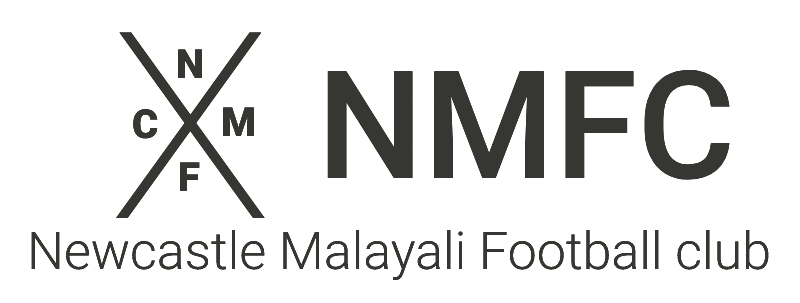
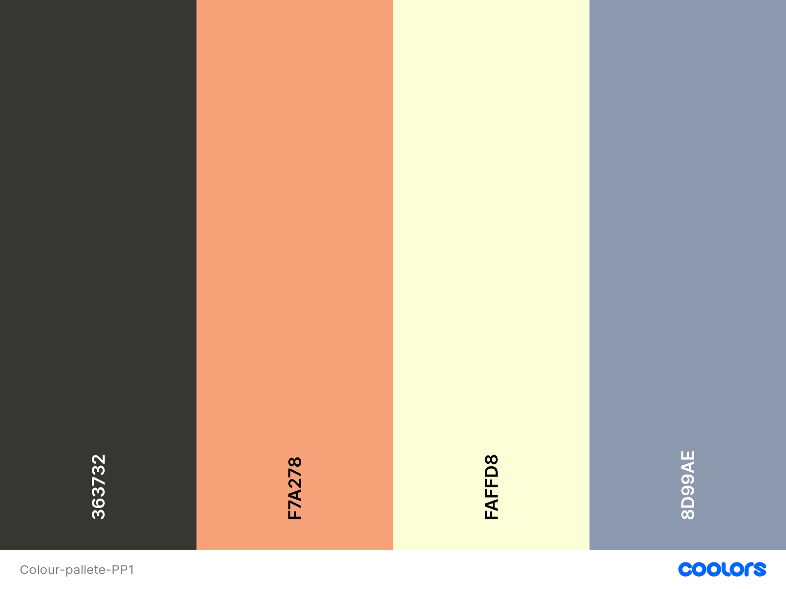

 
# Newcastle Malayali Football Club (NMFC)

## Goals for this project
Welcome to the NMFC, the top South indian football team in Newcastle Upon Tyne. NMFC is made up of 11 20-30 year old men from a variety of professions such as dentists to hydrogeolists. This site offers an insight into the club, upcoming games/tournaments and provides contact information for the possibility to try out or support the up and coming team. 

## Table Of Contents
## UX (user experience)
### Goals
* Easy to navigate through the website and to social media.
* Clear and succinct.
* Aesthetically pleasing. 
* Ability to contact the team.
* Valuable content.

### User's Needs
* From a user's perspective, I want to be able to navigate to any section of the website easily. 
* From a user's perspective, I want to be able to contact the Team.
* From a user's perspective, I want to be able to see the upcoming tournaments/ training sessions. 
* From a user's perspective, I want to be able to be directed to the team social media. 
* From a user's perspective, I want to be provided with information about the team and how it was founded.
* From a user's perspective, I want to be able to see a gallery of photos of games as well as a team photo. 

### Site Owners Goals
* Draw attention to the Team.
* Identify new people who want to join the team or join practise sessions.
* Let supporters know of upcoming fixtures.
* Attract potential sponsors to the team. 
## Design
### Social Media Icons
For the social media links, all icons was attained using [Fontawesome](https://fontawesome.com/ "Font Awesome"). This is because the icons are universally recognised and therefore the user would be able to navigate to the social media sites easily. The social media icons is present in the footer in all pages. 
### Fonts
[Google Fonts](https://fonts.google.com/ "Google Fonts") was used to find the fonts that are used in the website. I decided that for this sports related webstite, Roboto is clear and sharp. 

Header and navigational elements uses the Roboto medium 500 font and paragraph elements use the Roboto thin 300. Both the sizes of Roboto are complimentary to each other whilst still being able to see a clear difference between them. 
### Colour Scheme

The above image shows the colour scheme that has been decided for the website. I have used [Coolers](https://coolors.co/) to help me pick my pallet and the reason these colours have been selected is to represent and match the colour scheme of the team kit. 

| Colour  | Use |
| ------  | --- |
| #363732 | This colour will be used for the text and border colour for images. |
| #F7A278 | This Colour will be used for styling of the contact form. |
| #FAFFD8 | This colour will be used for the background and as contrasting text colour. |
| #8D99AE | This colour will be used for the header, navigation and footer. |

### Logo
The logo was created using [Photopea](https://www.photopea.com/ "Photopea"). I was able to create a simple and eyecatching logo. The logo also uses the Roboto Font for consistency, it is also coloured in #363732 to match the theme of the website. Furthermore, this logo will be present in all pages in the website in the header. 

## Wireframes
## Features
## Technologies used
### Langugages
* HTML5
* CSS3
### Libraries
### Tools
## Testing
## Deployments
## Credits
