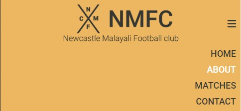
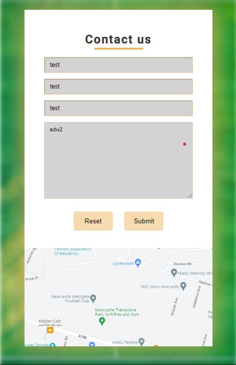
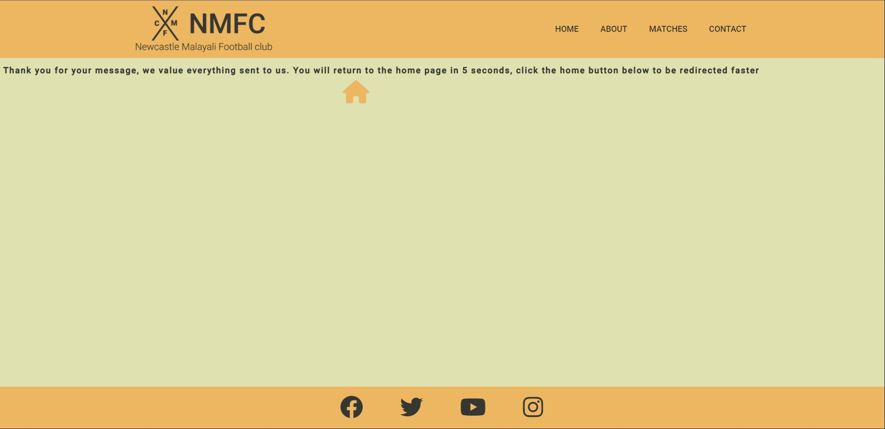

 
# Newcastle Malayali Football Club (NMFC)

## Goals for this project
Welcome to the NMFC, the top South indian football team in Newcastle Upon Tyne. NMFC is made up of 11 20-30 year old men from a variety of professions such as dentists to hydrogeolists. This site offers an insight into the club, upcoming games/tournaments and provides contact information for the possibility to try out or support the up and coming team. 

---

## UX (user experience)
### Goals
* Easy to navigate through the website and to social media.
* Clear and succinct.
* Aesthetically pleasing. 
* Ability to contact the team.
* Valuable content.

### User's Stories
* As a user, I want to be able to navigate to any section of the website easily. 
* As a user, I want to be able to contact the Team.
* As a user, I want to be able to see the upcoming tournaments. 
* As a user, I want to be able to be directed to the team social media. 
* As a user, I want to be provided with information about the team and manager.
* As a user, I want to be able to see photos of games as well as a team photo. 

### Site Owners Goals
* Draw attention to the Team.
* Identify new people who want to join the team or join practise sessions.
* Let supporters know of upcoming fixtures.
* Attract potential sponsors to the team. 

### Expectation
* I expect all links in the website to work correctly. 
* I expect all social media links to open in a new tab.
* I expect the website to be inviting and keep them engaged
* I expect users to be able to easily contact the team.
* I expect the user to be able to see upcoming fixtures and tournaments.

### Requirements
* There must be numerous pixtures of the team and especially a main picture of the entire team. 
* The website must be minimalistic and modern.
* When contacting the team, all required information must be filled in. If it is not, an error message must be supplied.
* The pages must be consistent throughout. 
---
## Design
### Social Media Icons
For the social media links, all icons was attained using [Fontawesome](https://fontawesome.com/ "Font Awesome"). This is because the icons are universally recognised and therefore the user would be able to navigate to the social media sites easily. The social media icons is present in the footer in all pages. 
### Fonts
[Google Fonts](https://fonts.google.com/ "Google Fonts") was used to find the fonts that are used in the website. I decided that for this sports related webstite, Roboto is clear and sharp. 

Header and navigational elements uses the Roboto medium 500 font and paragraph elements use the Roboto thin 300. Both the sizes of Roboto are complimentary to each other whilst still being able to see a clear difference between them. 
### Colour Scheme

The above image shows the colour scheme that has been decided for the website. I have used [Coolers](https://coolors.co/ "Coolers") to help me pick my pallet and the reason these colours have been selected is to represent and match the colour scheme of the team kit. 

| Colour  | Use |
| ------  | --- |
| #363732 | This colour will be used for the text and border colour for images. |
| #C0C762 | This Colour will be used for styling of the about us section. |
| #FFFFFF | This colour will be used for the background for some sections |
| #EDB761| This colour will be used for the header, navigation and footer. |

### Logo
The logo was created using [Photopea](https://www.photopea.com/ "Photopea"). I was able to create a simple and eyecatching logo. The logo also uses the Roboto Font for consistency, it is also coloured in #363732 to match the theme of the website. Furthermore, this logo will be present in all pages in the website in the header. 

### Breakpoints
3 breakpoints have been selected to which the website must be compatible. These breakpoints may not be used as the limits for media queries however it is vital that all information is presented clearly in these screen sizes and at a minimum of 320 px.  

|                |Size                             
|----------------|-----------------------------
|Small Screens|    < 480 px     
|Medium Screens| > 480 px
|Large Screens | > 1024 px

These breakpoints were selected with the aid of information provided from [Lambdatest](https://www.lambdatest.com/ "Lambdatest") an showed typical sizes of breakpoints that are utilised by modern websites. 

---
## Wireframes
To create the wireframe prototypes for a large, medium and small screens, Balsamiq was used. 
The wireframes are shown below:

[Large Screen](docs/wireframes/desktop-view.png "Large Screen")

[Medium Screen](docs/wireframes/ipad-view.png "Medium Screen")

[Small Screen](docs/wireframes/iphone-view.png "Small Screen")

---
## Features

### Navigation Bar

The first element that is noticed when you start the website is the navigation bar. The navigation bar is easy to use, functional and aesthetically pleasing. A hover effect has been implemented into the nav bar so that when hovering, a bar appears and the text is highlighted for a modern effect.

Navigation Bar:

Navigation Bar Hover: 

For smaller screens a hamburger menu has been utilised for optimal usage when using fingers/stylus' to access the webpage. This hamburger menu also highlights for small laptop users as well as this, the menu button opens and closes for ease of navigation. 

Smaller Screen Navigation Bar:

Smaller Screen Navigation Bar Open:

Smaller Screen Navigation Hover:

### Home Page

The next item that is identified by a user is the main image used. This is a picture of my football team taken from a previous tournament. This is a bright enticing image and gives the user an instant understanding of what the website is about, whilst also being able to see the team logo. I also included a box and link for upcoming fixtures as research shows that it is the main focal point as to why a user goes onto a football related website. To stick with the theme observed in the navigation, the same colours and hover effects are utilised. The colours used in this website is representative of the team kit colours. There is only one difference observed in the smaller screen version, which the lack of the fixtures button as it is easier to navigate using the hamburger icon. 

Home Page:

### About Us page

The about us page is the next section, which contains three images as well as the club values, club vision and manager. This is an important section as it allows a user to gain a deeper understanding of the website whilst not bombarding them with information. The about us page is responsive to different screen sizes which makes sure that the website is viewable and legible at all screen sizes. 

About Us Page (Large Screen View)

About Us Page (mobile & Small screen view)

### Match Details

The Match details section would be one of the most most visited aspects of the website as users would want to know the recent form of the team as well as upcoming matches to see how regularly the team play. A key detail in this section is that a game in which the team lost is highlighted in red tone which is complimentary to the other colours on the page. This page is also compatible with smaller devices and the image of the trophy is removed as the match history information is more important and having the image on its own does not suit the simplicity of the website. 

Match Details Page (Large Screen View)

Match Details Page (Small Screen View)

### Contact Us Page

The contact us section is a pivotal aspect of the website as it is the fastest and best for a user to get in contact with the club. The contact us section contains all required fields and a map on to help a user find the training/meeting grounds. The background used is a blurred image of a football pitch, keeping to the relevance of the website. Furthermore, validation is added to make sure all details are added so that it fasilitates the process of contacting either party. This section is also mobile friendly as the image of the map is presented directly below the contact us section. 

Contact Us Page (Large Screen View)

Contact Us Page (Small Screen View)

Contact Us Page (Field Validation)

The submission for contact us page is then directed to a dummy thank you page. This page contains a brief message stating that the information has been received and that the user will automatically be redirected back to the home page in 5 seconds. If however the user does not want to wait 5 seconds, they can click on the home button icon to get back faster. The home button icon also follows the same theme and when hovered, highlights as #fff. 

### Footer 

The footer is the final component to the webpage, this would be the hypothetical area in which the user would be able to access the various social media platforms for the team and offers another means of communication to the team. To keep consistency and balance, a hover effect was also implemented to this section which reflects what is observed in the navigation and other links throughout the website. The footer was made mobile friendly by decreasing the size of the icons used. Furthermore, a copyright was also added at the bottom left of the page. 

Large Screen footer view as well as hover effect

Small Screen footer view

---

## Potential Future Implementations

* With more time and resource, I would like to be able to collect the data provided by users into a database
* With more time and resource, I would like to implement further pages in which job notifications, headlines and vacancies can be presented.
* With more time and resource, I would improve the contact us interface for when mobile devices are being used as the web page zooms in and it is not aesthetically pleasing. From research, it appears that this is possible through JavaScript, which I have not covered yet.
* With more time and resource, I would want to have a shop selling club related items. 

---
## Technologies used
### Langugages
* HTML
* CSS
### Tools
* [Coolers](https://coolors.co/ "Coolors")
* [Photopea](https://www.photopea.com/ "Photopea")
* [W3C Markup Validation](https://validator.w3.org/ "W3C Markup Validation")
* [W3C CSS Validation](https://jigsaw.w3.org/css-validator/ "W3C CSS validation")
* [Git](https://git-scm.com/ "Git")
* [GitHub](https://github.com/ "GitHub")
* [GitPod](https://www.gitpod.io/ "GitPod")
### Libraries
* [Fontawesome](https://fontawesome.com/ "Font Awesome")
* [Google Fonts](https://fonts.google.com/ "Google Fonts")
* [Unsplash](https://unsplash.com/ "Unsplash")
---
## Testing

Testing was completed on the website post completion of all coding elements. Several issues were noted to be working incorrectly when testing however as most of the issues were resolved; the overall outcome of the website fulfils the requirements. The webstie covers all goals, user's stories, site owners goals, expectations. 

When conducting testing, the following issues were identified and resolved:

* The initial item noted was that the selected colour theme was not working for the website. It had too much contrast and the colours were not matching with each other and hence, it was not aesthethically pleasing. I solved this by testing multiple colour schemes to identify which one was simple yet effective and I learnt that I didn't need to use too many colours and overcomplicate the website. Finally the colour scheme selected is in the colour scheme section above.
* Further testing and review showed that a hamburger icon is required for a modern true mobile/tablet responsive website. This was implemented and the user interface was has greatly improved. A more in-depth review was completed and it was noted for optimal navigational ease, it was best to add the hamburger on the right side instead of the left side.  
* When the table was viewed on tablet/phone version, it webpage squished the picture of the trophy and eventually due to CSS grid would bring the picture under the table. However a solo picture of the trophy on the website didn't make sense and was also not effective. Therefore, I took the decision to remove the picture of the trophy in the mobile/tablet version. This produced a much better looking website. 
* When hovering over the different fields in the contact form, there wasn't any indication that it was the field that the mouse was over. Therefore to solve this, I added a lighter tone than the box. This improved the user interface.
* Only a hover effect was initially used over the navigation items. When I reviewed other webpages, i noticed that there was more of an indication that a nev element was hightlighted. I added a line underneath each section when highlighted for a better user interface.
* When I used the markup validation an error was identified that stated "Section lacks heading. Consider using h2-h6 elements to add identifying headings to all sections, or else use a div element instead for any cases where no heading is needed" as a heading is not required for the main image, the section element was changed to div. 
* Final W3C Markup validation was completed for index.html and the following results were observed:

* Final W3C Markup validation was completed for the thankyou.html and the following results were observed:

* Final W3C CSS validation was completed the following results were observed:

* Final lighthouse test was completed and the following results were observed:
    * Desktop

    * Mobile

On reflection of the website, it is clear that all user stories and requirements for the website have been met. 

---
## Deployments
Post completion of coding, the project was added, committed and pushed to github. The github repository was made live completing the following steps:

* Click on the **project repository**.

* Then click on the **settings** section.

* Then select **pages** under the code and automation section in the side navigation bar.

* Change the source to **deplay from a brand**.

* Select the branch `Main/ (root)` and press **save**.

* The website is live on the following link: `https://YOURUSERNAME.github.io/YOURPROJECTNAME/`

* Any future changes can be completed by **adding**, **committing** and **pushing** updates to github
---
## Credits
* [Simen Daehlin](https://www.linkedin.com/in/simendaehlin/) - Assistance throughout the project
* [Kevin Powell](https://www.youtube.com/@KevinPowell) - Navigation bar formatting and CSS grid 
* [Unsplash](https://unsplash.com/ "Unsplash") - Media used for the contact us background image
---
## Inspirations
* [Cardiff City FC](https://www.cardiffcityfc.co.uk/)
* [Carlisle United FC](https://www.carlisleunited.co.uk/)
* [Newcastle United FC](https://www.nufc.co.uk/)

